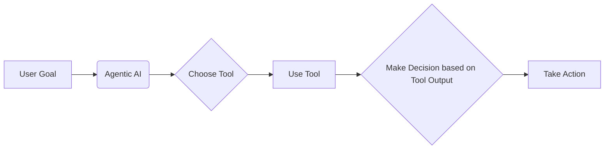
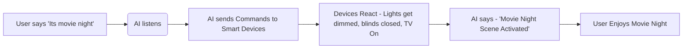

```mermaid
graph LR
    A[User Goal] --> B(Agentic AI);
    B --> C{Choose Tool};
    C --> D[Use Tool];
    D --> E{Make Decision based on Tool Output};
    E --> F[Take Action];
```

```mermaid
graph LR
    A[User says 'Its movie night'] --> B(AI listens);
    B --> C[AI sends Commands to Smart Devices];
    C --> D[Devices React - Lights get dimmed, blinds closed, TV On];
    D --> E[AI says - 'Movie Night Scene Activated'];
    E --> F[User Enjoys Movie Night];
```
