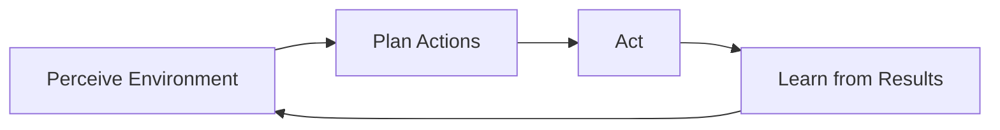
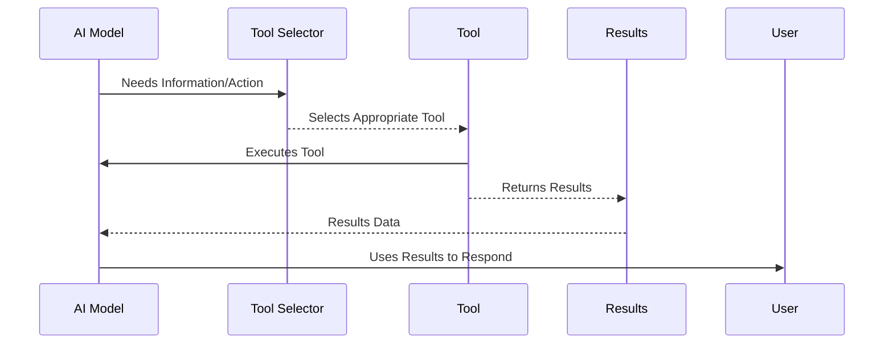
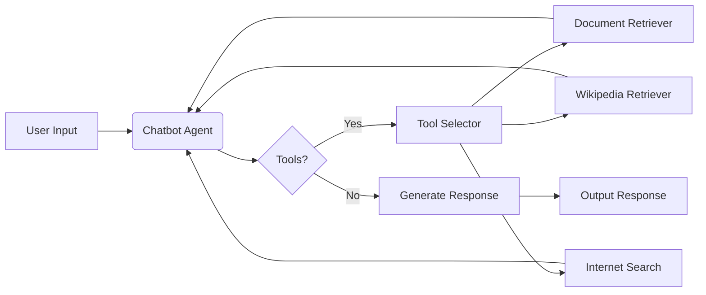

# Agentic AI Chatbot Demo: Tool Calling in Action

**Tagline:** A simple chatbot showcasing Agentic AI and Tool Calling concepts through practical code.

## What is Agentic AI?

Imagine an AI that's not just waiting for your commands, but more like a helpful digital assistant. That's the idea behind **Agentic AI**. It's about creating AI systems that have **agency**, meaning they can:

- **Perceive:** Understand information and their environment.
- **Plan:** Figure out how to achieve goals.
- **Act:** Take steps to make things happen.
- **Learn:** Get better over time based on experience.

Think of it as an AI that can think, decide, and act on its own to solve problems, rather than just reacting to your direct instructions.

Here's a simple diagram showing the "agency loop":

## What is Tool Calling?

A key part of making Agentic AI work is **Tool Calling**. Even the smartest agent needs tools to get things done in the real world. "Tools" in this context can be anything that extends the AI's abilities, like:

- **Search Engines:** To find information online.
- **Databases:** To access specific data.
- **APIs:** To interact with other services (like weather or calendars).
- **Functions:** Pieces of code that perform specific tasks.

**Tool Calling** is the AI's ability to:

1.  **Recognize** when it needs to use a tool.
2.  **Choose** the right tool for the job.
3.  **Use** the tool effectively.
4.  **Understand** the results from the tool.

This lets the AI go beyond its own built-in knowledge and actually _do_ things in the world.

Here's a diagram of the Tool Calling process:

## Chatbot: A Practical Example of Agentic AI and Tool Calling

This repository contains code for a simple chatbot that demonstrates these concepts in action!

**How it shows Agentic AI:**

- **Tool Selection:** When you ask a question, the chatbot doesn't just try to answer from memory. It **decides** if it needs to use different tools to find the answer.
- **Autonomous Action:** It automatically uses tools like:
  - **Document Retriever:** To search through uploaded documents (RAG).
  - **Wikipedia Search:** To look up information on Wikipedia.
  - **Internet Search:** To search the web for the latest information.
- **Goal-Oriented:** The chatbot's goal is to answer your questions effectively by leveraging these tools.

**How it shows Tool Calling:**

- **Defined Tools:** The code defines three "tools" for the chatbot to use: `retriever_tool`, `wikipedia_retriever_tool`, and `internet_search_tool`.
- **Intelligent Tool Use:** The chatbot (powered by [Langchain's ReAct Agent](https://langchain-ai.github.io/langgraph/reference/prebuilt/)) intelligently chooses which tool to use (or if it needs to use multiple tools) to answer your query.

Here's a simplified architecture of the chatbot, showing how it uses tools:

## Tools and Technologies Used

- **Streamlit:** For creating the interactive web application.
- **Langchain:** Framework for building agentic applications and tool calling.
- **OpenAI, Google Gemini, Groq Models:** Large Language Models powering the chatbot.
- **Hugging Face Transformers:** For document embeddings.
- **FAISS:** For efficient vector storage and similarity search.
- **Tavily Search API:** For internet search functionality.
- **Wikipedia Retriever:** For accessing Wikipedia content.
- **Python:** The programming language used.
