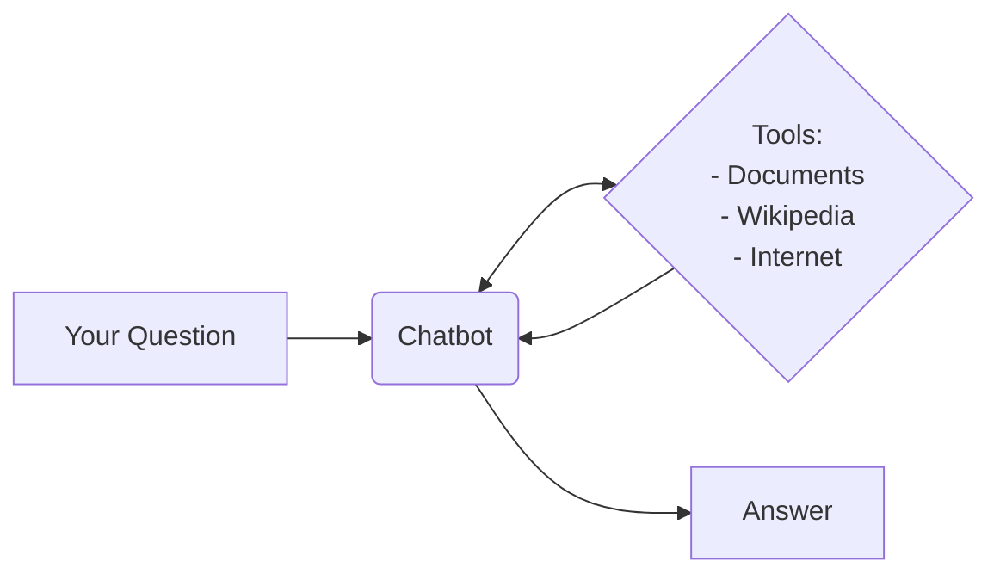
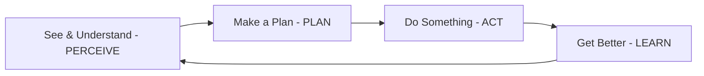
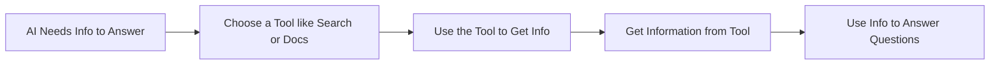
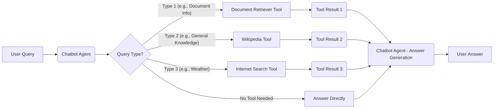

# Agentic-AI Chatbot Demo: Tool Calling in Action

**Tagline:** See a chatbot that thinks and uses tools, just like a helpful assistant! (Code included!)

This repository contains the code for an advanced AI chatbot that uses LangChain agents and tools to provide intelligent, context-aware responses.

It dynamically decides which tool to invoke - be it a retrieval system, web search, or Wikipedia query - depending on the user's question. This ensures precise and relevant answers every time.

**TRY THE CHATBOT LIVE DEMO HERE**

## Chatbot Features

- **Dynamic Tool Selection**: The agent intelligently decides which tool to use based on the query.
- **Retrieval-Augmented Generation (RAG)**: Answer user's questions based on documents given to it.
- **Web Search Integration**: Searches the internet in real-time for up-to-date answers.
- **Wikipedia Integration**: Queries Wikipedia for factual and detailed information.
- **Persistent Memory**: Maintains session context to provide continuity across conversations.

## How It Works

1. **Query Input**: The user submits a query through the Streamlit frontend.
2. **Agent Decision**: The LangChain agent determines the most relevant tool to handle the query.
3. **Tool Execution**: The selected tool fetches the required data.
4. **Response Generation**: The agent combines tool output with reasoning to generate the final response.

## Use Cases

- Quick fact-checking and research.
- Summarizing complex topics.
- Answering domain-specific questions with retrieval capabilities.

## What makes this chatbot special?

It uses agentic approach ...

## What is Agentic AI?

**Think of it like a Smart Assistant!**

Imagine you have a really smart assistant who can do more than just follow simple instructions. That's Agentic AI!

It's about making AI that can:

- **Understand** what's going on around it (like reading information or seeing things).
- **Make Plans** to achieve a goal (like figuring out steps to solve a problem).
- **Take Action** on its own (like using tools or making decisions).
- **Learn** and get better over time.

Instead of just reacting to your every command, an Agentic AI can think for itself and take initiative to help you.

Here's a simple way to think about how Agentic AI works:

## What is "Tool Calling"?

**Tool Calling - Giving AI the Right Resources.**

To be really helpful, even a smart assistant needs tools. Think of it like giving a student access to books, the internet, and a calculator to help them answer questions. For AI, "tools" are things like:

- **Search Engines:** To find info on the web.
- **Databases:** To look up facts.
- **Special Programs:** To do specific jobs, like checking the weather.

**"Tool Calling"** is simply the AI's ability to:

1.  Realize it needs extra help (a "tool").
2.  Pick the best tool for the job.
3.  Use the tool to get information or take action.
4.  Use the tool's results to solve your problem.

It's how we give AI the resources it needs to be truly useful and go beyond what it already "knows."

Here's a simple diagram of how Tool Calling works:

## How this Chatbot implements Agentic AI and Tool Calling

The code in this repository is used to build a simple chatbot to demonstrate how Agentic AI & Tool Calling works.

**Try the Chatbot Live Demo Here**

**How does the Agentic chatbot work?**

- **It Chooses Tools:** When you ask a question, the chatbot decides if it needs to use special tools to find the answer. It doesn't just guess!
- **It Acts on its Own:** It can automatically use these tools:
  - **Document Tool:** To read stories or documents you give it.
  - **Wikipedia Tool:** To check Wikipedia for facts.
  - **Internet Tool:** To search the web for up-to-date info.
- **It Has a Goal:** The chatbot tries its best to answer your questions using all the resources it has.

**How it shows Tool Calling:**

- **It Has "Tools":** The code gives the chatbot three tools: a Document Tool, a Wikipedia Tool, and an Internet Tool.
- **It Uses Tools Smartly:** The chatbot figures out which tool (or tools) will be most helpful to answer your question.

Here's a simple picture of how the chatbot uses tools:

## Tech Stack

- **[LangChain](https://langchain.com/)**: Framework for building language model applications.
- **[FAISS](https://github.com/facebookresearch/faiss)**: For efficient vector search and document retrieval.
- **[HuggingFace Embeddings](https://huggingface.co/sentence-transformers)**: Semantic similarity for knowledge retrieval.
- **[Streamlit](https://streamlit.io)**: Interactive frontend for user-friendly interactions.

## LangChain Tools Used

1. **[RAG Tool](https://python.langchain.com/docs/tutorials/rag/)**: Retrieves information from a pre-defined knowledge base.
2. **[Search Tool](https://python.langchain.com/docs/integrations/tools/tavily_search/)**: Fetches results from the web.
3. **[Wikipedia Tool](https://python.langchain.com/docs/integrations/tools/wikipedia/)**: Pulls data from Wikipedia.
